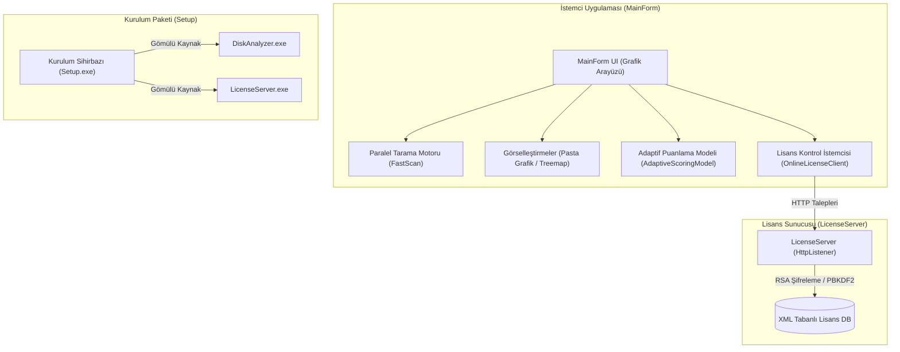

# 🛸 Advanced Disk Analyzer v2.0

[](#derleme)
[](#gereksinimler)
[](#derleme)
[](#lisans)

**Windows için geliştirilmiş, yüksek performanslı, skor tabanlı disk alanı analiz ve akıllı temizlik aracı.**

Advanced Disk Analyzer, disk alanınızı derinlemesine tarayarak hangi dosya ve klasörlerin ne kadar yer kapladığını görselleştiren, gereksiz dosyaları akıllı bir puanlama modeliyle bulan ve güvenli bir şekilde temizleyen masaüstü uygulamasıdır. Üç bağımsız C# bileşeninden oluşur ve **harici hiçbir kütüphane veya NuGet paketi gerektirmeden** tamamen ham Windows API'leri ile derlenebilir.

---

## 📈 Sistem Mimarisi

Aşağıdaki şemada uygulamanın istemci, sunucu ve kurulum bileşenlerinin birbiriyle olan ilişkisi gösterilmektedir:



---

## 📁 Proje Dosya Yapısı

Projeniz GitHub'a yüklenmeye hazır şekilde aşağıdaki temiz ve modüler yapıyı korumaktadır:

```text
AdvancedDiskAnalyzer-cagan/
├── .gitattributes             # Satır sonu (CRLF) ve binary dosya kuralları
├── .gitignore                 # GitHub için yoksayılan geçici/derleme çıktı dosyaları
├── app.ico                    # Uygulama simgesi (derleme için gereklidir)
├── logo.png                   # README ve arayüz görselleri için logo
├── logo_hq.png                # Yüksek çözünürlüklü logo dosyası
├── build.bat                  # Tek tıkla tüm projeyi derleyen betik
├── README.md                  # Bu doküman
├── LICENSE                    # MIT Lisans belgesi
├── Program.cs                 # Ana İstemci Uygulaması kaynak kodu (~7.800 satır)
├── LicenseServer.cs           # HTTP Lisans Sunucusu kaynak kodu (~800 satır)
├── Setup.cs                   # Kurulum Sihirbazı kaynak kodu (~500 satır)
├── ADA_Lisans_Mimarisi_Sunumu.pptx # Lisans mimarisi sunum dosyası
└── AdvancedDiskAnalyzer_Sunum.pptx # Genel proje tanıtım sunum dosyası
```

---

## ✨ Öne Çıkan Özellikler

### 🚀 1. Gelişmiş Tarama Motorları
* **NTFS Turbo Tarama (MFT):** NTFS dosya sistemindeki Master File Table (MFT) kayıtlarını doğrudan disk sektörlerinden okuyarak saniyeler içinde milyonlarca dosyayı tarar. (Yönetici yetkisi gerekir).
* **Hızlı WinAPI Tarama:** `FindFirstFile` / `FindNextFile` Win32 API'leri kullanarak çok çekirdekli sistemlerde paralel özyinelemeli arama yapar. Yönetici yetkisi gerektirmez.
* **Canlı Tarama Güncellemesi:** Tarama sırasında bulunan dosyalar arka plan iş parçacığından akıcı bir şekilde ListView'e eklenir, taramanın bitmesini beklemeden arama yapabilirsiniz.

### 📊 2. Modern Görselleştirmeler
* **Dinamik Pasta Grafik (Pie Chart):** Seçilen klasör altındaki boyut dağılımını gösterir. Dilimlerin üzerine gelindiğinde dilim dışarı kayar ve detaylı bilgi kartı (Tooltip) belirir.
* **Akıllı Treemap:** Hiyerarşik disk alanı dağılımını kare alanlar halinde çizer. Derinlemesine analiz için tıklama ile klasörler arasında geçiş yapılabilir.

### 🧠 3. Akıllı Analiz ve Temizlik Kuralları
* **Adaptif Skorlama Modeli:** Her dosyaya `0` ile `100` arasında bir "Gereksizlik Skoru" atar. Ağırlıklar:
  * Boyut Skoru (%34) — Logaritmik büyüme
  * Yaş Skoru (%24) — Son değişiklik tarihi
  * Temizlik İpuçları (%24) — Geçici dosya türleri (`.tmp`, `.bak`, `.log` vb.)
  * Konum Skoru (%18) — Temp veya Geri Dönüşüm Kutusu yolları
  * **Koruma Cezası (-%28)** — Windows ve Program Files altındaki kritik dosyaların yanlışlıkla silinmesini önleyen negatif ceza sistemi.
* **Güvenli Silme:** Seçilen dosyaları doğrudan yok etmek yerine Windows Recycle Bin API'sini (SHFileOperation) kullanarak Geri Dönüşüm Kutusu'na gönderir.

### 🔒 4. Çift Sayım Koruması & Disk Uyumları
* **Hard Link Muhasebesi:** NTFS dosya sisteminde aynı fiziksel veriye işaret eden hard link'lerin dosya kimliği (`FileIndex`) üzerinden tespiti yapılarak diskin gerçek boyutunun yanlış ölçülmesi (çift sayma) engellenir.
* **Diskte Kaplanan Alan (Allocated Size):** Cluster büyüklüğü hesabı yapılarak dosyanın mantıksal boyutu yerine diskte gerçekte işgal ettiği alan (slack space) hesaplanır.

---

## 🛠️ Derleme Kılavuzu

Projenin derlenmesi için bilgisayarınızda sadece standart .NET Framework 4.0 veya üzeri yüklü olması yeterlidir.

### A. Otomatik Derleme (Önerilen)
Dizindeki `build.bat` betiğini çalıştırmanız yeterlidir. Tüm bağımlılıklar sırasıyla derlenecek ve nihai `AdvancedDiskAnalyzerSetup.exe` oluşturulacaktır.
```batch
.\build.bat
```

### B. Adım Adım Manuel Derleme
C# derleyicisini (`csc.exe`) kullanarak el ile derlemek için terminalde aşağıdaki komutları çalıştırın:

1. **Ana Uygulamayı Derleme (`DiskAnalyzer.exe`):**
   ```batch
   C:\Windows\Microsoft.NET\Framework64\v4.0.30319\csc.exe /target:winexe /codepage:65001 /win32icon:app.ico /out:DiskAnalyzer.exe /reference:System.Windows.Forms.dll /reference:System.Drawing.dll /reference:System.Management.dll Program.cs
   ```
2. **Lisans Sunucusunu Derleme (`LicenseServer.exe`):**
   ```batch
   C:\Windows\Microsoft.NET\Framework64\v4.0.30319\csc.exe /target:exe /codepage:65001 /out:LicenseServer.exe /reference:System.Data.dll LicenseServer.cs
   ```
3. **Kurulum Sihirbazını Derleme (`AdvancedDiskAnalyzerSetup.exe`):**
   *(Yukarıdaki iki yürütülebilir dosyayı kaynak olarak kurulum sihirbazının içine gömer)*
   ```batch
   C:\Windows\Microsoft.NET\Framework64\v4.0.30319\csc.exe /target:winexe /codepage:65001 /win32icon:app.ico /out:AdvancedDiskAnalyzerSetup.exe /reference:System.Windows.Forms.dll /reference:System.Drawing.dll /resource:DiskAnalyzer.exe,DiskAnalyzer.exe /resource:LicenseServer.exe,LicenseServer.exe Setup.cs
   ```

---

## 💻 Sistem Gereksinimleri

| Bileşen | Gereksinim |
| :--- | :--- |
| **İşletim Sistemi** | Windows 7 / 8 / 10 / 11 |
| **İşlemci Mimarisi** | x86 veya x64 |
| **Çalışma Zamanı** | .NET Framework 4.0 veya üzeri |
| **Yetkilendirme** | NTFS MFT doğrudan sektör erişimi için Yönetici (Administrator) yetkisi |

---

## 📜 Lisans

Bu proje **[MIT Lisansı](LICENSE)** altında lisanslanmıştır. Projeyi dilediğiniz gibi değiştirebilir, ticari veya kişisel amaçlarla serbestçe kullanabilirsiniz.
